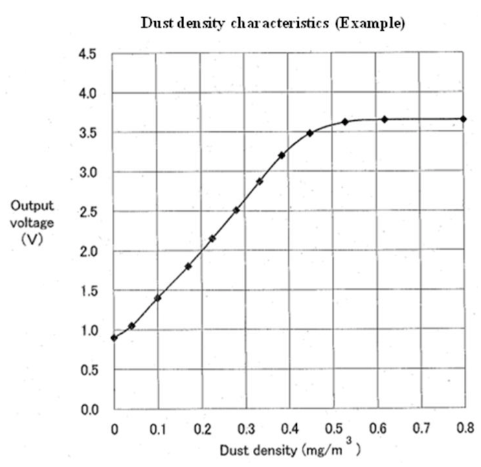

# Sharp dust sensor GP2Y1010AU0F

The sensor just measures the dust concentration by converting the reflected light of a laser into a voltage. This is the linearety diagram:

We can use this to estimate a formula from the voltage we measure:

Analog read from Arduino 0 - 1024
Respective voltage: 0 V - 5 V
Respective particles/m^3 : 0.1*voltage + 0.9

Other formulas: 
0.17*voltage - 0.1
