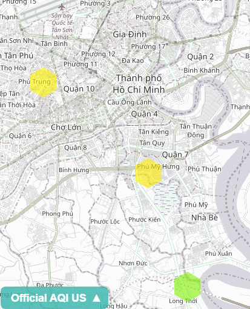

# Sensor data

At the moment we have 3 sensors running in Ho Chi Minh City:

## 12779556 Nha Be outdoor since 2018-10-08 9:21

Link to csv data: https://www.madavi.de/sensor/csvfiles.php?sensor=esp8266-12779556

## 416796 Nha Be indoor since 2018-12-

Link to csv data: https://www.madavi.de/sensor/csvfiles.php?sensor=esp8266-416796

## 1129419 Phu My Hung outdoor since 2018-04-

Link to csv data:

## Data processing to sqlite3 with kaggle

Using data science tools at kaggle like panda on python and jupyter notebook we can convert the CSV raw data into a database. The process incolves the following steps: 

1. Import csv files.
2. Run panda as pd.csv_import (../import/*) AS TABLE CREATE

The finished 2018.db file can be found here:

Since data is now stored in double instead of string the whole 2018-2019 database for the three sensors is reduced from 913MByte to 24 MByte.

### Compress data for hourly values

The sensors submit data every 145 seconds we collect a lot of data. For processing it is sufficient to get the hourly average. While processing we can eliminate spikes as well.

## Visualization

We use mathpyplot to visualize. Some results:
