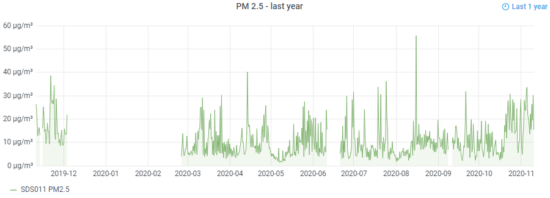
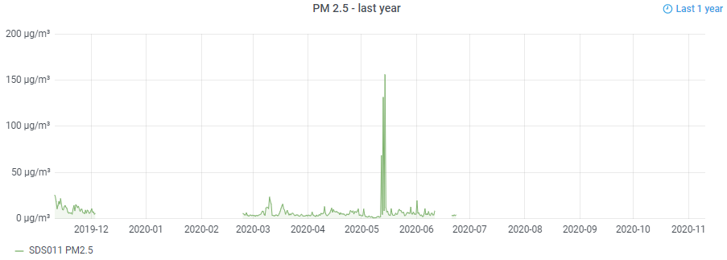
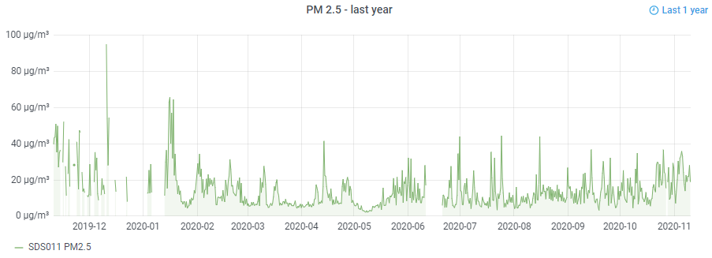
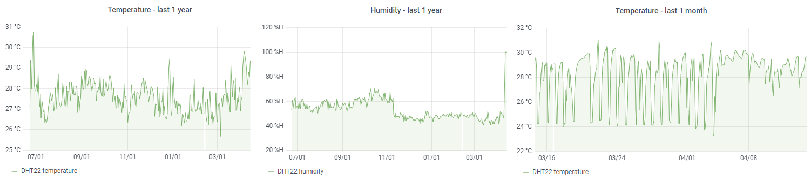

# AQI - Air Quality Index

As of now we have 3 sensors installed that transmit data every 5 minutes and collect the measurements in a database. Two sensors are located in Nha Be (one indoors and one outdoors) and another one is located in Phy My Hung. Let's compare the PM 2.5 values from last year:

## Nha Be outdoor (12779556)

Here is [the link](https://api-rrd.madavi.de/grafana/d/GUaL5aZMz/pm-sensors?orgId=1&theme=light&var-chipID=esp8266-12779556) to the dashboard for all the recent data of PM2.5 and PM10. Further there is [humidity and temperature](https://api-rrd.madavi.de/grafana/d/q87EBfWGk/temperature-humidity-pressure?orgId=1&var-chipID=esp8266-12779556).

## Nha Be indoor (8808591)

Here is [the link](https://api-rrd.madavi.de/grafana/d/GUaL5aZMz/pm-sensors?orgId=1&theme=light&var-chipID=esp8266-8808591) to the dashboard for all the recent data of PM2.5 and PM10. Further there is [humidity and temperature](https://api-rrd.madavi.de/grafana/d/q87EBfWGk/temperature-humidity-pressure?orgId=1&var-chipID=esp8266-8808591).

## Phy My Hung outdoor (1129419)

Here is [the link](https://api-rrd.madavi.de/grafana/d/GUaL5aZMz/pm-sensors?orgId=1&var-chipID=esp8266-1129419) to the dashboard for all the recent data of PM2.5 and PM10. Further there is [humidity and temperature](https://api-rrd.madavi.de/grafana/d/q87EBfWGk/temperature-humidity-pressure?orgId=1&var-chipID=esp8266-1129419).

## Phy My Hung indoor (4872940)

Here is [humidity and temperature](https://api-rrd.madavi.de/grafana/d/q87EBfWGk/temperature-humidity-pressure?orgId=1&var-chipID=esp8266-4872940) most recent.

//
//## PM2.5 Nha Be (outdoor and indoor) and Phu My Hung outdoor, last 24 hours

//
//
//

//## Temperature

//
//
//

//## Humidity

//
//
//

## More specific sensor data

PM 2.5 and PM10
Temperature and Humidity

The air in Ho Chi Minh City is getting more and more polluted in recent years. Can we add some valid data to the smog and fog we see more often?

## Measure and educate

In order to understand the situation we want to build our own sensors and collect data. Building helps understand __WHAT__ AQI, PM10 and PM2.5 are and what the relation to our health is. The same time we learn __HOW__ to measure the quality of air. We will try to measure Ozon, PM2.5 and Carbon Monoxide.

1. [MQ-131](https://www.lazada.vn/products/mq-131-ozone-sensor-module-ozone-gas-detection-i334848456-s537210369.html?spm=a2o4n.searchlist.list.1.a2451d0cT7TbpJ&search=1) sensor with black cap for low concentration 390,000₫ 
2. [GP2Y1010AU0F](https://icdayroi.com/cam-bien-bui-pm2-5gp2y1010au0f) PM2.5 sensor 102,000₫
3. [LM393 CO MQ-7](https://icdayroi.com/cam-bien-khi-co-mq-7) CO sensor 10-1000 ppm (AQI 105-999) 25,000₫

## Simple Arduino, Sharp sensor and 1602 display

You can get a finished sensor with Arduino, 1602 display and the sharp sensor GP2Y1010AU0F for 20 dollars or 419,000 VND:
[lazada.vn: Household PM2.5 Detector Module](https://www.lazada.vn/products/household-pm25-detector-module-air-quality-dust-sensor-tft-lcd-display-monitor-i211854287-s265229101.html?spm=a2o4n.searchlist.list.109.21c729f7x9fcvY&search=1)

The sensor itself and the parts are roughly the same at (icdayroi.com):
- [GP2Y1010AU0F](https://icdayroi.com/cam-bien-bui-pm2-5gp2y1010au0f) PM2.5 sensor 102,000₫
- [Arduino Uno R3 SMD CH380](https://icdayroi.com/arduino-uno-r3-smd) with different USB chip 80,000₫
- [LCD 1602 5V](https://icdayroi.com/lcd-1602) to show the measured data 30,000₫

## Luftdaten.info

Measure the AQI at AISVN and publish the data. This is the map with our data:
[https://maps.luftdaten.info/#12/10.7422/106.7044](https://maps.luftdaten.info/#12/10.7422/106.7044) 

## Database

Our Sensors:
- [12779556](https://www.madavi.de/sensor/graph.php?sensor=esp8266-12779556-sds011) Outdoor sensor in Nha Be at the campus of the AISVN with [DHT22](https://www.madavi.de/sensor/graph.php?sensor=esp8266-12779556-dht)
- [416796](https://www.madavi.de/sensor/graph.php?sensor=esp8266-1129419-sds011) Second sensor at AISVN, indoor in front of 407B as display - Micro NodeMCU 16pin, display, [DHT22](https://www.madavi.de/sensor/graph.php?sensor=esp8266-416796-dht)
- [1129419](https://www.madavi.de/sensor/graph.php?sensor=esp8266-416796-sds011#l_week) Outdoor sensor in Quận 7, at Nội khu Hưng Phước 1, Tân Phong, Hồ Chí Minh, Vietnam with [DHT22]()
- [8808591](https://www.madavi.de/sensor/graph.php?sensor=esp8266-8808591-sds011) Nha Be indoor with Nova SDS011 and [DHT22](https://www.madavi.de/sensor/graph.php?sensor=esp8266-8808591-dht), NodeMCU wide
- [3633371](https://www.madavi.de/sensor/graph.php?sensor=esp8266-3633371-dht) NodeMCU micro 16pin 1602 DHT22
- [416796](https://www.madavi.de/sensor/graph.php?sensor=esp8266-416796-dht) NodeMCU narrow 30pin
- [4872940](https://www.madavi.de/sensor/graph.php?sensor=esp8266-4872940-dht) NodeMCU narrow 30pin
- [13455399]() NodeMCU on Arduino board without sensor

The measurements of the last year(s) are stored in the database as zip filed. Further project: import (automatically?) into a sqlite database and analyze/visualize with jupyter.

## Sensor list

|                |  PM2.5 and PM10        |    Temp./Humidity      | Details            |
|----------------|------------------------|------------------------|--------------------|
| Nha Be outdoor | [12779556](https://www.madavi.de/sensor/graph.php?sensor=esp8266-12779556-sds011)           | [12779556](https://www.madavi.de/sensor/graph.php?sensor=esp8266-12779556-dht)           | Outdoor since 2019 |
| AISVN indoor   | [8808591](https://www.madavi.de/sensor/graph.php?sensor=esp8266-8808591-sds011)           | [8808591](https://www.madavi.de/sensor/graph.php?sensor=esp8266-8808591-dht)           | Indoor since 2019  |
| Phy My Hung    | [1129419](https://www.madavi.de/sensor/graph.php?sensor=esp8266-1129419-sds011)           | [1129419](https://www.madavi.de/sensor/graph.php?sensor=esp8266-12779556-dht)           | Outdoor since 2018 |
| Phy My Hung    |                       | [4872940](https://www.madavi.de/sensor/graph.php?sensor=esp8266-4872940-dht)           | Indoor since 2020 |

## Video

Here is [the link](https://youtu.be/julMgNcVdVA).

## Reference

1. [Project on instructables](https://www.instructables.com/id/How-to-Interface-With-Optical-Dust-Sensor/) from 2016
2. [Datasheet Sharp GP2Y1010AU0F](https://global.sharp/products/device/lineup/data/pdf/datasheet/gp2y1010au_appl_e.pdf)
